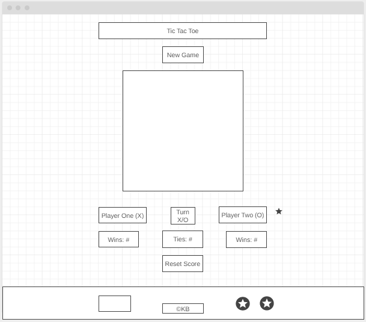
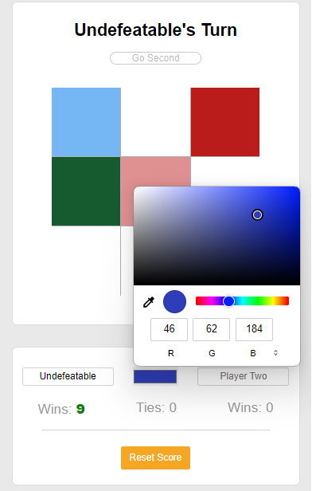
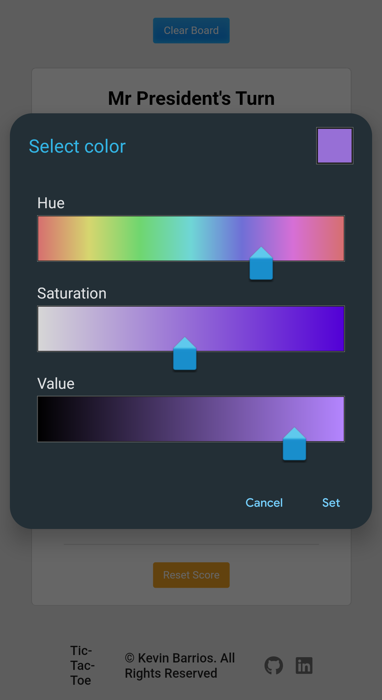

# Tic-Tac-Toe

Introducing Tic-Tac-Toe with a with a simpler and more creative approach. Bring the classic game from paper to modern technology. Try it out for yourself!

[Play Tic-Tac-Toe](https://kbarrios.dev/tic-tac-toe/)

# Tech

The game is built with a simple interface using HTML, CSS, and JavaScript. HTML builds the structure while CSS adds to the decorative features, and JavaScript builds the logic to make the game interactive.

- JavaScript
- CSS
- HTML

## **Snapshots**
## Wireframe
The original wireframe for the website layout



# Color Selection
Freely choose your assortment of colors. The game keep tracks of your move at all times



# Mobile Integration
The game is mobile friendly, so you can play on the go!



# Features
Is it really a game if you can't play it? The Tic-Tac-Toe game offers a variety of features to make your experience more enjoyable

- Play against another player from your phone or computer
    - Select on an opening and try to out-strategize your opponent

- Update your player
    - Each player can change their name using alphanumeric characters, symbols, or even emoji's
    - Change your box's color to embrace your unique style

- Board
    - Choose who goes first each round
    - Reset the board to restart the game
    - Reset the game scores to start fresh new matches

- Interactive Sounds
    - Helps avoid any awkward silence in between matches

# Behind The Scenes
The Tic-Tac-Toe game was build with the user experience in mind. Here are a couple of examples of how that is achieved.

- Updating player names: As a user updates their name, it also updates the display name at the top of the board and updates the modal that appears once a round is over. The same is applied for the players' wins and ties counts. However, when a user would delete their name, the website renders the now-deleted value as an empty string and removes the name embedded for the user. The code itself was not much of a problem for what would create an inconvinient user experience. Here's an example of the solution

```
if (e.target.id === "player-one") {
    playerOne.name = e.target.value === "" ? "Player One" : e.target.value;
  } else {
    playerTwo.name = e.target.value === "" ? "Player Two" : e.target.value;
  }
```
- Updating input color: Another section that required an outside-the-box approach is updating inside the box of the input color. The input box is where a user can choose their designated color switches to the current player's color. As each player takes a turn, the color box changes color along with the game. Here's an example of the code:

```
function switchPlayer() {
  currentPlayer = currentPlayer === playerOne ? playerTwo : playerOne;
  currentPlayerName.innerText = currentPlayer.name;
  playerColorChoice.value = currentPlayer.color;
}
```

## Future
There's always plans for improving the game in the future so look out for more features along the way!
- [ ] Local Storage to save points and opponent history
- [ ] AI opponent
- [ ] Play online with other players

Credits
A special thanks to [Jeff Ou](https://github.com/pophero110) and [Dominique Akers](https://github.com/Dommy99) for their feedback on the Tic-Tac-Toe game.
